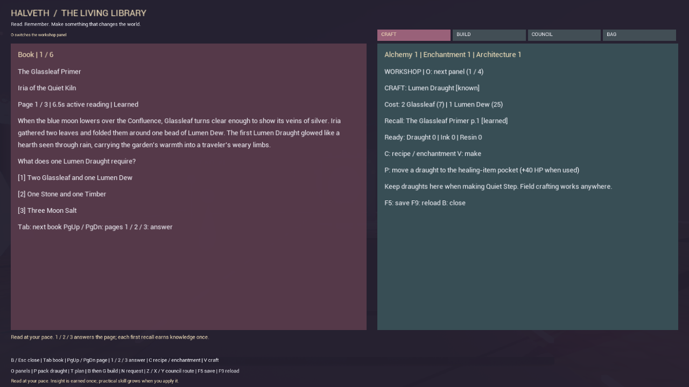

<!-- HUB_LANGUAGES_V1 -->
[Original / Deutsch](README.md) · [English](README.en.md) · [Русский](README.ru.md)
<!-- /HUB_LANGUAGES_V1 -->

# HALVETH Portal Garden 0.2.0

<!-- HALVETH_WORK_CERTIFICATES_V1_1 -->
## Juri Janovski / Juri Halveth – Privates HALVETH-Werkzertifikat

[Privates HALVETH-Werkzertifikat: Dokumentierte portable C++-Quellprüfungen – HALVETH Portal Garden](https://juri-halveth.github.io/werkzertifikate/#werk-halveth-unreal).

HALVETH VERACHEL STUDIOS · Quellstand, dokumentierte Ergebnisse und SHA-256-Belege stehen im Werkzertifikat. Private, mit Codex erstellte Werkdokumentation; keine ISTQB- oder sonstige Personenzertifizierung.
<!-- /HALVETH_WORK_CERTIFICATES_V1_1 -->


An independent native C++ world prototype for **Unreal Engine 5.8**. Explore four luminous realms, learn from original books, turn recipes into useful items, enchant your magic and place structures in the garden. The world is generated locally from a small seed. The prototype runs offline without a browser, server, wallet, account or AI subscription.

**0.2 adds the Living Library:** read original lore, learn recipes, practise crafting and carry your constructions back through the portals. See the [0.2 native validation](docs/NATIVE-VALIDATION-0.2.0.md) and [versioned release record](docs/RELEASE-VALIDATION-0.2.0.json) for the tested build and its limits.

**One playable entry:** start the installed game shortcut or `HALVETHRealms.exe`.
Exploration, guides, books, recall, inventory, crafting, enchantment, construction,
council choices, graphics settings and credits all live inside the native game.
There is no browser panel or companion server required for this play loop. Keep
the supplied engine and content files beside the executable; it is a complete
game folder, not a single-file executable. Future connected features follow the
[in-game integration direction](docs/IN-GAME-DIRECTION.md).

This is a separate Unreal project. It does not convert an existing Morrowind installation, import a Morrowind save, or change Genesis/OpenMW. Its names, geometry and gameplay code are original HALVETH work; Epic engine resources are dependencies supplied by your own Unreal installation.

## What is in the world

| Place | Visual design | Playable connection |
|---|---|---|
| The Confluence | Violet stone, glowing waymarks, three illuminated gates | Hub to every realm |
| Scarlet Garden | Crimson canopies, a heart-shaped landmark, warm lights | Return gate to the hub |
| Lucinet Tidelight | Cyan crystals and suspended, rotating-looking geometric layers | Return gate to the hub |
| Rachel Memory Garden | Golden archive pillars and an open architectural landmark | Return gate to the hub |

The C++ runtime creates the geometry, lighting, collision, portal interaction and native HUD. Forty seeded environmental props per realm and thirty moving emissive fireflies give each destination a distinct layout. Two floor material sources are included: 2K cobblestone and forest-floor PBR maps, under their recorded CC0 terms. They are imported by the preparation commandlet.

The adventure component adds health, regenerating mana and stamina, a stamina-based dodge, three spells, three consumable item types and three guide profiles. SPARK is a moving projectile with collision and damage against the training crystal; the crystal breaks and reforms. AEGIS reduces received damage, while LOVE restores health and lights the surroundings. The guides use original authored dialogue with local conversation steps.

The 0.2 knowledge system adds:

- **Six original texts across fifteen pages:** three books, one scroll, one margin note and a council journal. Pages connect lore to explicit recipes and construction rules.
- **Three skills:** Alchemy, Enchantment and Architecture. First successful page recall grants knowledge once. Reading time records engagement, not comprehension; it imposes no minimum wait and grants no idle XP.
- **Three recipes:** Lumen Draught, Ward Ink and Binding Resin. The workshop shows required pages, material costs and available quantities. Successful crafting spends materials and grants practical XP.
- **Two enchantments, each with three ranks:** Lantern Weave adds 10 maximum mana per rank; Quiet Step reduces spell costs by 5% per rank.
- **Three structures:** Ground / Workbench, Camp and Beacon. A completed Ground is the workshop milestone for the other structures. Placement requires clear, flat garden ground; up to 32 constructions are recorded.
- **Three council decisions with three alternatives each:** choices produce different resources and fictional Kindness, Balance and Insight values. Each decision and reward is recorded once.
- **Local persistence:** learned pages, recipes, practical progress, materials, packed consumables, enchantments, council choices and placed constructions are stored per world seed.

Sixteen marked garden nodes cover all seven raw materials across the four realms. Press **E** nearby to gather; each new interaction can gather again. Nodes remain available and gathering grants no XP. Leaving the library open also grants no practical XP. Multiplayer, larger streamed territories, voice and connected AI conversations remain future work.

## Play

Published packages are listed under [Releases](https://github.com/Juri-Halveth/halveth-unreal/releases). Use the version shown on the selected release. The 0.2 packaging target is `HALVETH-Portal-Garden-Setup-0.2.0-x64.exe`, with the desktop shortcut **HALVETH Portal Garden 0.2.0**. Portable packages start through **HALVETHRealms.exe**. The runtime does not require the Unreal Editor; building the source requires Unreal Engine and a C++ toolchain. Development packages are unsigned.

The installer uses `%LOCALAPPDATA%\HALVETH\PortalGarden\0.2.0` and a separate versioned Start menu folder. It retains the 0.1 installation and shortcuts. An existing shortcut with the new version's exact name is retained rather than replaced. Uninstallation preserves save data and unknown files.

| Input | Action |
|---|---|
| WASD / mouse | Walk / look |
| Space / left Shift | Jump / run |
| E near a marker, book, guide or portal | Gather, read, speak or travel |
| Q / left mouse button | Select / cast LOVE, SPARK or AEGIS |
| L | Select and cast LOVE |
| I / F | Select / use an inventory item |
| Left Ctrl | Dodge, using stamina |
| B | Open the library and workshop |
| T / G | Select a structure / place it on visible ground ahead |
| R | Return home and recover position |
| 1 / 2 / 3 | Performance / Balanced / Epic graphics |
| H | Show or hide controls |
| F10 | Open or close credits and license notices |
| Escape | Quit the game |

| In the library | Action |
|---|---|
| Tab | Next text |
| Page Up / Page Down | Previous / next page |
| 1 / 2 / 3 | Answer the current page's recall prompt |
| O | Cycle the right-hand information panel |
| C / V | Select a recipe or enchantment / craft or enchant |
| P | Pack one crafted Lumen Draught into the healing-item pocket |
| T | Select the next structure |
| N | Select the next council decision |
| Z / X / Y | Choose its first / second / third alternative |
| F5 / F9 | Save progress / reload saved progress for this seed |
| B / Escape | Close the library |

To build, select a structure with **T**, close the library with **B**, face clear ground and press **G**. To use a crafted healing draught, pack it with **P**, close the library, select the healing item with **I** and use **F**; it restores up to 40 health. An item is retained when its resource is already full.

The initial frame limit is 60 FPS. Performance mode lowers render resolution and switches off Lumen and virtual shadow maps. Balanced and Epic request higher-quality lighting; they are options, not measured performance promises. Falling off an island returns the character to its spawn point.

## Saved progress

The default world seed is **127**. Persistent knowledge is stored outside versioned application directories:

```text
%LOCALAPPDATA%\HALVETH\PortalGarden\SaveGames\knowledge-SEED.json
```

For the default world this is `knowledge-127.json`. Progression actions and periodic updates save dirty state. **F5** requests a save; **F9** replaces in-memory knowledge and inventories with the last stored state. Save failures are reported in the library. An incompatible or damaged file is preserved rather than silently overwritten; keep a backup before recovering such a slot.

The slot contains reading counters, learned pages, recipes, XP, gathering history, workshop and consumable inventories, enchantment ranks, council choices and construction positions in each realm. It is not a complete session snapshot: player position, current realm, health, mana, stamina, temporary spell effects and guide conversation steps are not resumed. A session starts in the Confluence and restores supported progression for its seed.

The save location is shared across application versions; compatibility is determined by the save schema. Parallel installation does not itself guarantee compatibility with future schemas. Back up the slot before testing a version that changes its format.

## Build on Windows

The project targets UE **5.8**. The recorded 0.1 local engine baseline is **5.8.0, changelist 55116800**, with MSVC **14.51.36257**. See [engine baseline and sources](docs/ENGINE-BASELINE.md) for that historical environment and the separately published Epic version. Use a C++/Windows SDK toolchain accepted by your installed engine. The build helper never installs or updates the engine.

From the project directory, in PowerShell:

```powershell
./scripts/build.ps1 -EngineRoot 'C:\Program Files\Epic Games\UE_5.8' -Stage Build
./scripts/build.ps1 -EngineRoot 'C:\Program Files\Epic Games\UE_5.8' -Stage Prepare
```

`Build` compiles the runtime and editor modules. It limits compilation to two parallel actions to bound memory use and passes `-NoUBA`; this engine still reported its local executor, so that flag is not a claim that every UBA component is disabled. `Prepare` creates the original color/emission material and imports the locally supplied CC0 floor maps into `/Game/Materials`. Existing prepared assets are retained. Engine meshes are referenced from the installed engine; no engine source is copied into this repository.

Open `HALVETHRealms.uproject` and press **Play**, or launch directly:

```powershell
& 'C:\Program Files\Epic Games\UE_5.8\Engine\Binaries\Win64\UnrealEditor.exe' `
  './HALVETHRealms.uproject' -game -HalvethSeed=127 -HalvethQuality=1 -windowed
```

The entry level is the engine's standard `/Engine/Maps/Entry`. The configured game mode builds the world when play begins. No hand-authored binary map is required.

For a standalone development build:

```powershell
./scripts/build.ps1 -EngineRoot 'C:\Program Files\Epic Games\UE_5.8' -Stage Package -RuntimeNoticesRoot '<prepared-notices-folder>'
```

This runs Unreal's BuildCookRun and archives a build under `Builds/Windows`. Engine runtime notices and the original-source license are carried into that output. After UAT has finished and notices are finalized, prepare the versioned installer with:

```powershell
./scripts/package_installer.ps1 -PackageReady -Version 0.2.0
```

The packaging script defaults to 0.2.0, binds its exact payload to a manifest and refuses to overwrite an existing installer artifact. Follow [the packaging instructions](docs/BUILDING.md) for the notice collection and prerequisite tools. Explicitly select 0.2 when using examples retained from the earlier release.

## Verification

```powershell
python -m unittest discover -s tests -v
python scripts/validate_project.py
./scripts/build.ps1 -EngineRoot 'C:\Program Files\Epic Games\UE_5.8' -Stage Smoke
```

The production algorithms are directly testable as C++20 through `tests/layout_test.cpp` and `tests/knowledge_test.cpp`, without Unreal. Knowledge tests cover original catalogs, page recall, material transactions, enchantments, constructions, council decisions and state restoration. Python tests cover source structure and source export. These checks do not verify native rendering or installation.

`Smoke` launches the real game mode with `-HalvethSmokeTest -NullRHI`, runs its current gameplay assertions and writes `Saved/HALVETH-runtime-smoke.json`. Retain the fresh record and its exact test scope for the candidate being packaged. A NullRHI result does **not** verify rendered appearance, frame rate, audio or physical keyboard/mouse input. Native visual playtesting is a separate release check.

The [0.2 validation](docs/NATIVE-VALIDATION-0.2.0.md) records the packaged gameplay sequence and the four native library views. Its [release record](docs/RELEASE-VALIDATION-0.2.0.json) binds installation checks and artifact hashes. CI separately validates portable C++ and source delivery; it does not compile Unreal Engine. Earlier [native validation](docs/NATIVE-VALIDATION.md) and [release records](docs/RELEASE-VALIDATION.json) remain unchanged as 0.1 history.



The [expansion roadmap](docs/EXPANSION-ROADMAP.md) retains the larger character, story, AI, animation and world-streaming branches. The declared visual-asset budget is up to **50 GB**, with assets added for a visible purpose rather than to reach a file-size target. [Knowledge design](docs/KNOWLEDGE-DESIGN.md) and the [open-content register](docs/OPEN-CONTENT-SOURCES.md) distinguish source-backed inspiration from actual imported content.

## Project layout

- `Source/HALVETHRealms`: native world, player, adventure and knowledge components, training target, HUD and portable algorithms.
- `Source/HALVETHRealmsEditor`: material-generation and local texture-import commandlet; excluded from the game runtime.
- `Config`: engine, input, packaging and default seed settings.
- `ArtSource/PolyHaven`: original CC0 source maps with provider links, byte counts and hashes in `MANIFEST.json`.
- `assets` and `Build/Windows`: original icon sources and Windows icon.
- `tests` and `scripts`: bounded tests and rebuild entry points.
- `Content/Materials`: generated Unreal assets, reproducible from the included source art and preparation commandlet.

## Reuse

Original project code is **MIT licensed**, allowing use, modification, redistribution and commercial use subject to the license notice. See [LICENSE](LICENSE). Artwork and dependencies keep their own explicit licenses. Poly Haven maps are CC0; icon provenance is recorded separately. Unreal Engine is governed by Epic's own terms and is not relicensed by this repository. See [THIRD-PARTY-NOTICES.md](THIRD-PARTY-NOTICES.md).

The Windows installer uses unmodified NSIS 3.12 components. Preserve its notices and corresponding upstream source as described in [installer licenses](docs/INSTALLER-LICENSES.md). Source code, installer, portable ZIP and validation records are separate artifacts.

The prototype contains no blockchain transactions, wallet access, token sales, automatic online publication or Steam integration. Those are future product decisions and should not be inferred from the word “portal” or the deterministic seed. A world seed is a reproducibility setting, not a wallet seed phrase.
