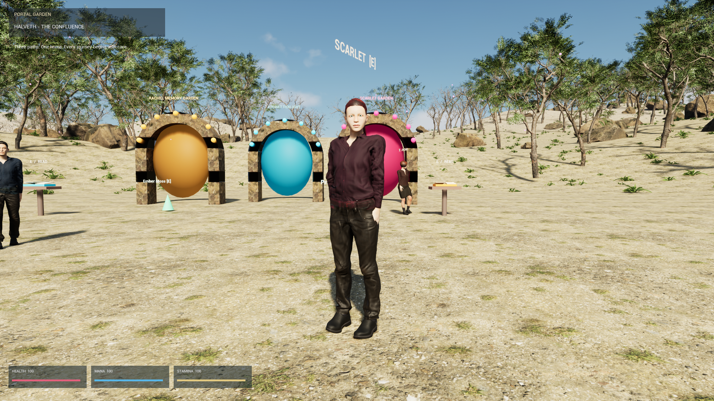

# HALVETH Portal Garden — anatomical characters, ground response and Earth sky

Four locally generated 600 × 600 metre landscapes with hills, CC0 forest scans,
portal arches, spell practice, library, crafting and persistent construction.
Scarlet, Lucinet and Rachel now use dressed, skinned human meshes with individual
face targets, authored hair and eyes, a twelve-second breathing/idle animation,
blinking, nearby-player gaze and dialogue-triggered mouth motion. They now walk
with capsule collision and gravity, place their feet on traced ground, transfer
weight, move their hands/fingers and respond with hair/garment deformation.
Ground patches deform under a declared mass/support model and update collision.
A dated NASA/JPL Sun trajectory drives the 24-hour sky, with volumetric clouds,
decorative stars and authored night lighting.



This is an independent HALVETH game in Unreal Engine 5.8. The OpenMW adapter
changes original Morrowind objects through its own loaded model paths. Its
private retail-derived clothing files are not part of this public repository.

## Verified current development build

The 2026-10-04 world-contact increment gives every placed tree a simple colliding
trunk. The following body/development increment replaces the fixed 6 × 5.2 metre
patrol with individual terrain-supported goal selection, exploration, book and
portal visits, and recovery. Ground probes and capsule sweeps steer the next step;
translational velocity drives gait,
avoiding invented strides from turning in place. Capture cameras and
dialogue tests follow the moving guide. See [world-contact scope and measurements](docs/WORLD-SCALE.md).

The current body increment derives pelvis support from anatomical leg lengths,
removes the permanent crouch and independent eye oscillation, rebuilds face
targets, and connects reserve, breathing and response to actual movement.
A growing virtual genome records development events and adapts future behavior.
See [body and development](docs/BODY-AND-DEVELOPMENT.md) and its current receipt.

The C++ build and the 31-step native gameplay sequence passed. Three character
checks verified the skeleton, eight morph targets and sampled internal head/hand
motion. Native motion capture additionally tested a 1.5 metre fall, walkable
ground and deforming collision. An accelerated 24-hour sky sequence observed day
and night using 25 dated NASA/JPL samples. The explicit current shadow path uses
four cascades after a GPU page fault in the initial accelerated VSM/Nanite run.
A separate DX12 run produced twelve reviewed 1920 × 1080 views.
The crystal took four SPARK hits, broke and reformed after five simulation seconds.

The character rebuild replaces generated tube clothing and hair with authored
CC0 meshes fitted to anatomy, preserved UVs, garment normal maps, masked hair and
separate modeled footwear. Runtime stance targets narrow the rigging A-pose and
relax the hands beside the body. The regeneration entry point also refreshes its
public byte inventory after FBX sanitizing.

See [the current body and development receipt](QA/native-body-development.json),
[the previous character rebuild receipt](QA/native-character-rebuild.json),
[the historical landscape receipt](QA/native-landscape.json),
[motion, gravity and sky](docs/MOTION-EARTH-SKY.md),
[character construction](docs/CHARACTERS.md) and
[world and crystal checks](docs/GARDEN-LANDSCAPE.md).
Skin microdetail, facial corrective shapes, richer captured gait, cloth simulation,
fantasy-specific wardrobes and several props still need art work. The screenshots
show the current game; they are not concept renders.

## Git Bash launch

Use a locally installed/licensed Unreal Engine 5.8 with its Windows C++
prerequisites, Git Bash and Python:

```bash
bash GARDEN.sh play
```

The launcher downloads declared CC0 nature inputs through `experiments/void-native`,
prepares authored geometry and character assets and compiles changed source.
Later starts reuse bound local assets. `GARDEN_ENGINE` selects the engine;
`GARDEN_PYTHON` selects Python; `GARDEN_VOID_ROOT` selects a local VOID source tree.
`bash GARDEN.sh check` runs native gameplay checks; `bash GARDEN.sh visual` runs
the automated rendered capture. `bash GARDEN.sh motion` runs a short motion/gravity
capture with sparse 2 Hz stills. Bash orchestrates the native C++ game and art tools.
`bash GARDEN.sh sky` refreshes the Sun data. The observer is a declared virtual
site, 45° N and 0° E. Cached later days repeat the explicitly dated path; clouds,
stars and night fill are authored, rather than a live weather or Moon service.

## Rebuild character art

The selected CC0 inputs, FBX sources, textures and MIT builders are included.
Normal game startup uses the supplied FBX files and needs no Blender installation.
To regenerate the art, install Blender 4.5, NumPy and Pillow, then:

```bash
export GARDEN_BLENDER="/c/path/to/blender.exe"
export GARDEN_PYTHON=python
bash CHARACTERS.sh build
bash GARDEN.sh prepare
```

The anatomical deformation also transfers to authored clothing and hair. FBX path
sanitizing replaces local author paths with relative filenames and verifies the
parsed numeric geometry, skeleton and animation digest remains identical.

## Playable systems

Books, fifteen pages, recall, seven raw materials, three recipes, two enchantments
with three ranks, consumables, LOVE/SPARK/AEGIS, guide dialogue, council choices
and three construction types remain integrated. Progress is saved locally under
the existing world key. Automated tests/capture use an isolated test slot.

| Input | Action |
|---|---|
| WASD / mouse | Walk / look |
| Space / left Shift | Jump / run |
| E near a marker, book, guide or portal | Gather, read, speak or travel |
| Q / left mouse button | Select / cast LOVE, SPARK or AEGIS |
| L | Select and cast LOVE |
| I / F | Select / use an inventory item |
| Left Ctrl | Dodge, using stamina |
| B | Open the library and workshop |
| T / G | Select a structure / place it on visible ground ahead |
| R | Return home and recover position |
| 1 / 2 / 3 | Performance / Balanced / Epic graphics |
| H | Show or hide controls |
| F10 | Open or close credits and license notices |
| Escape | Quit the game |

| In the library | Action |
|---|---|
| Tab | Next text |
| Page Up / Page Down | Previous / next page |
| 1 / 2 / 3 | Answer the current page's recall prompt |
| O | Cycle the right-hand information panel |
| C / V | Select a recipe or enchantment / craft or enchant |
| P | Pack one crafted Lumen Draught into the healing-item pocket |
| T | Select the next structure |
| N | Select the next council decision |
| Z / X / Y | Choose its first / second / third alternative |
| F5 / F9 | Save progress / reload saved progress for this seed |
| B / Escape | Close the library |

To build, select a structure with **T**, close the library with **B**, face clear ground and press **G**. To use a crafted healing draught, pack it with **P**, close the library, select the healing item with **I** and use **F**; it restores up to 40 health. An item is retained when its resource is already full.

## Licenses and source

Original HALVETH C++/Bash/Python source is MIT. MakeHuman core basemesh, rig,
weights and target assets are CC0. The selected skins use the expressly CC0 pack
members recorded in [SOURCES.json](ArtSource/Characters/SOURCES.json). Authored CC0 clothing, footwear and hair retain their license headers and hashes in [wardrobe-sources.json](ArtSource/Characters/wardrobe-sources.json). Own eyes, fabric and animation additions are dedicated to CC0.
See [MakeHuman's asset license](https://static.makehumancommunity.org/about/license.html)
and [the character license](ArtSource/Characters/LICENSE.txt).

Nature scans include [Tree Small 02](https://polyhaven.com/a/tree_small_02),
[Fern 02](https://polyhaven.com/a/fern_02) and
[Rock Moss Set 01](https://polyhaven.com/a/rock_moss_set_01), with URLs and hashes
in the VOID asset pipeline. Blender and Unreal remain separately licensed tools.
Engine binaries, generated Content, caches, saves and raw logs stay outside Git.
Current characters have no dependency on the earlier Epic mannequin placeholders.

The historical releases retain their own records. This branch is a development
source delivery; it does not claim a new standalone installer or complete AAA remake.
See [engine notices](THIRD-PARTY-NOTICES.md) and
[existing adventure mechanics](docs/ADVENTURE.md).

<!-- HALVETH_WORK_CERTIFICATES_V1_1 -->
## Juri Janovski / Juri Halveth – Privates HALVETH-Werkzertifikat

[Privates HALVETH-Werkzertifikat: Dokumentierte portable C++-Quellprüfungen – HALVETH Portal Garden](https://juri-halveth.github.io/werkzertifikate/#werk-halveth-unreal).

HALVETH VERACHEL STUDIOS · Quellstand, dokumentierte Ergebnisse und SHA-256-Belege stehen im Werkzertifikat. Private, mit Codex erstellte Werkdokumentation; keine ISTQB- oder sonstige Personenzertifizierung.
<!-- /HALVETH_WORK_CERTIFICATES_V1_1 -->
