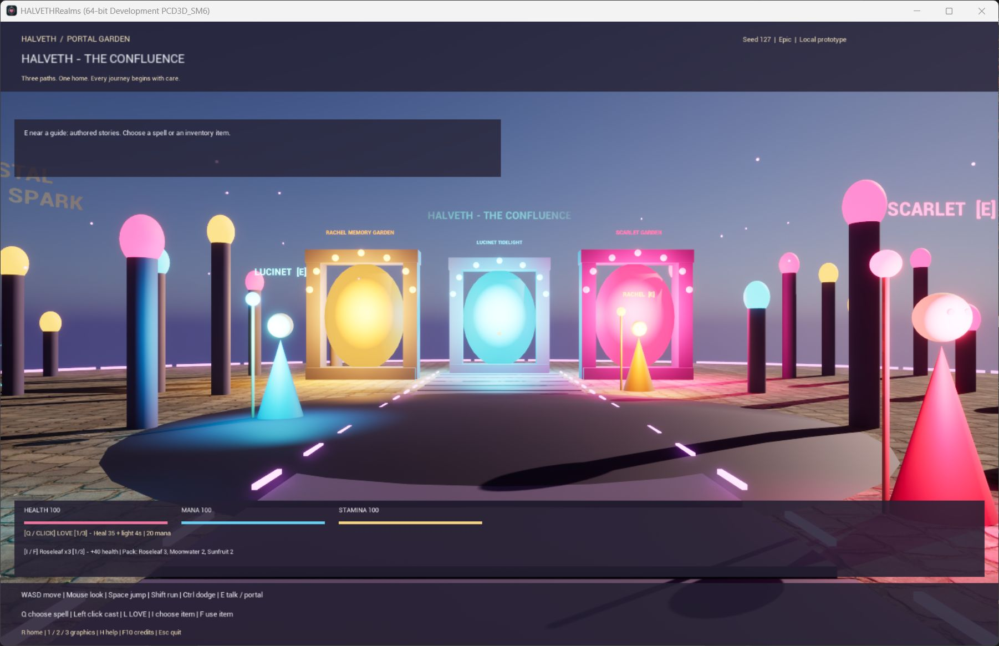

# HALVETH Portal Garden

An original C++ world prototype for **Unreal Engine 5.8**. Walk through a luminous hub, enter three distinct realms, meet three authored guides, cast LOVE, Spark and Shield, and practise against a regenerating crystal. The world is generated locally from a small seed. No server, wallet, account or AI subscription is required to play this prototype.

This is a separate Unreal project. It does not convert an existing Morrowind installation, import a Morrowind save, or change Genesis/OpenMW. Its names, geometry and gameplay code are original HALVETH work; Epic engine resources are dependencies supplied by your own Unreal installation.

## What is in the world

| Place | Visual design | Playable connection |
|---|---|---|
| The Confluence | Violet stone, glowing waymarks, three illuminated gates | Hub to every realm |
| Scarlet Garden | Crimson canopies, a heart-shaped landmark, warm lights | Return gate to the hub |
| Lucinet Tidelight | Cyan crystals and suspended, rotating-looking geometric layers | Return gate to the hub |
| Rachel Memory Garden | Golden archive pillars and an open architectural landmark | Return gate to the hub |

The C++ runtime creates the geometry, lighting, collision, portal interaction and native HUD. Forty seeded environmental props per realm and thirty moving emissive fireflies give each destination a distinct layout. Two floor material sources are included: 2K cobblestone and forest-floor PBR maps, under their recorded CC0 terms. They are imported by the preparation commandlet.

The adventure component adds health, regenerating mana and stamina, a stamina-based dodge, three spells, three consumable item types and three guide profiles. Spark is a moving projectile with collision and damage against the training crystal; the crystal breaks and reforms. Shield reduces received damage, while LOVE restores health and lights the surroundings. The guides use original authored dialogue, with local conversation steps; they do not contact a language model or the internet. World persistence, multiplayer, larger streamed territories and online services remain separate development work unless a later release explicitly implements them.

## Play

Download the Windows installer or portable ZIP from [Releases](https://github.com/Juri-Halveth/halveth-unreal/releases). Start **HALVETHRealms.exe** or the installed **HALVETH Portal Garden** shortcut. The package runs without the Unreal Editor; building the source requires Unreal Engine and a C++ toolchain. This is an unsigned Development preview.



| Input | Action |
|---|---|
| WASD / mouse | Walk / look |
| Space / left Shift | Jump / run |
| E near a portal or guide | Enter the named destination or advance the guide's dialogue |
| Q / left mouse button | Select / cast LOVE, Spark or Shield |
| L | Select and cast LOVE |
| I / F | Select / use an inventory item |
| Left Ctrl | Dodge, using stamina |
| R | Return home and recover position |
| 1 / 2 / 3 | Performance / Balanced / Epic graphics |
| H | Show or hide controls |
| F10 | Open or close credits and license notices |
| Escape | Quit the game |

The initial frame limit is 60 FPS. Performance mode lowers render resolution and switches off Lumen and virtual shadow maps. Balanced and Epic request higher-quality lighting; they are options, not measured performance promises. Falling off an island returns the character to its spawn point.

## Build on Windows

The project targets UE **5.8**. The installation inspected for this build is **5.8.0, changelist 55116800**. The editor C++ build passed locally with MSVC **14.51.36257**. Epic also announced **5.8.2** on 25 August 2026; that published version is separate from the locally installed version. See [engine baseline and sources](docs/ENGINE-BASELINE.md). Use a C++/Windows SDK toolchain accepted by your installed engine. The build helper never installs or updates the engine.

From the project directory, in PowerShell:

```powershell
./scripts/build.ps1 -EngineRoot 'C:\Program Files\Epic Games\UE_5.8' -Stage Build
./scripts/build.ps1 -EngineRoot 'C:\Program Files\Epic Games\UE_5.8' -Stage Prepare
```

`Build` compiles the runtime and editor modules. It limits compilation to two parallel actions to bound memory use and passes `-NoUBA`; this engine still reported its local executor, so that flag is not a claim that every UBA component is disabled. `Prepare` creates the original color/emission material and imports the locally supplied CC0 floor maps into `/Game/Materials`. Existing prepared assets are retained. Engine meshes are referenced from the installed engine; no engine source is copied into this repository.

Open `HALVETHRealms.uproject` and press **Play**, or launch directly:

```powershell
& 'C:\Program Files\Epic Games\UE_5.8\Engine\Binaries\Win64\UnrealEditor.exe' `
  './HALVETHRealms.uproject' -game -HalvethSeed=127 -HalvethQuality=1 -windowed
```

The entry level is the engine's standard `/Engine/Maps/Entry`. The configured game mode builds the world when play begins. No hand-authored binary map is required.

For a standalone development build:

```powershell
./scripts/build.ps1 -EngineRoot 'C:\Program Files\Epic Games\UE_5.8' -Stage Package -RuntimeNoticesRoot '<prepared-notices-folder>'
```

This runs Unreal's BuildCookRun and archives a build under `Builds/Windows`. Engine runtime notices and the original-source license are carried into that output. Follow [the complete packaging instructions](docs/BUILDING.md) for the validated notice folder and the installer. The observed build and game checks are recorded in [native validation](docs/NATIVE-VALIDATION.md).

## Verification

```powershell
python -m unittest discover -s tests -v
python scripts/validate_project.py
./scripts/build.ps1 -EngineRoot 'C:\Program Files\Epic Games\UE_5.8' -Stage Smoke
```

The production seed algorithm is also directly testable as C++20 via `tests/layout_test.cpp`, without Unreal. It was compiled and executed with MSVC 14.51: 20 seed/realm combinations, 800 prop placements, repeatability and the six reversible hub routes passed. Python tests cover source structure and the source-export contract. These checks do not stand in for engine compilation or rendering.

`Smoke` launches the real game mode with `-HalvethSmokeTest -NullRHI`. Its 24 steps take approximately 29 seconds after startup. They check a spawned player, floor collision, all three portal round trips, invalid-destination rejection, fall recovery, graphics-profile calls, heal-item consumption without waste at full health, Shield damage reduction, LOVE recovery, guide dialogue, actual dodge movement, four Spark impacts, crystal breakage and regeneration. It exits with an error on a failed assertion and writes a fresh `Saved/HALVETH-runtime-smoke.json`. A NullRHI result explicitly does **not** verify rendered appearance, frame rate, audio or physical keyboard/mouse input. Native visual playtesting is a separate release check.

On 23 September 2026, the editor C++ build, material preparation, 24-step engine test and **Windows BuildCookRun** passed. The same game-state test also passed in the **packaged executable**, and a separate DX12 / SM6 window rendered the packaged world on an RTX 4070 SUPER. See [native validation](docs/NATIVE-VALIDATION.md) for scope and limitations. CI separately validates portable C++ and source delivery; it does not compile Unreal Engine.

The [expansion roadmap](docs/EXPANSION-ROADMAP.md) retains the larger character, story, persistence, AI, animation and world-streaming branches. The declared visual-asset budget is up to **50 GB**, with assets added for a visible purpose rather than to reach a file-size target.

## Project layout

- `Source/HALVETHRealms`: native game, world, player, adventure component, training target, HUD and portable layout algorithm.
- `Source/HALVETHRealmsEditor`: material-generation and local texture-import commandlet; excluded from the game runtime.
- `Config`: engine, input, packaging and default seed settings.
- `ArtSource/PolyHaven`: original CC0 source maps with provider links, byte counts and hashes in `MANIFEST.json`.
- `assets` and `Build/Windows`: original icon sources and Windows icon.
- `tests` and `scripts`: bounded tests and rebuild entry points.
- `Content/Materials`: generated Unreal assets, reproducible from the included source art and preparation commandlet.

## Reuse

Original project code is **MIT licensed**, allowing use, modification, redistribution and commercial use subject to the license notice. See [LICENSE](LICENSE). Artwork and dependencies keep their own explicit licenses. Poly Haven maps are CC0; icon provenance is recorded separately. Unreal Engine is governed by Epic's own terms and is not relicensed by this repository. See [THIRD-PARTY-NOTICES.md](THIRD-PARTY-NOTICES.md).

The Windows installer uses unmodified NSIS 3.12 components. Its own notices and corresponding upstream source accompany the release; see [installer licenses](docs/INSTALLER-LICENSES.md). The source code, installer, portable ZIP and their validation records are published as distinct artifacts.

The prototype contains no blockchain transactions, wallet access, token sales, automatic online publication or Steam integration. Those are future product decisions and should not be inferred from the word “portal” or the deterministic seed. A world seed is a reproducibility setting, not a wallet seed phrase.
