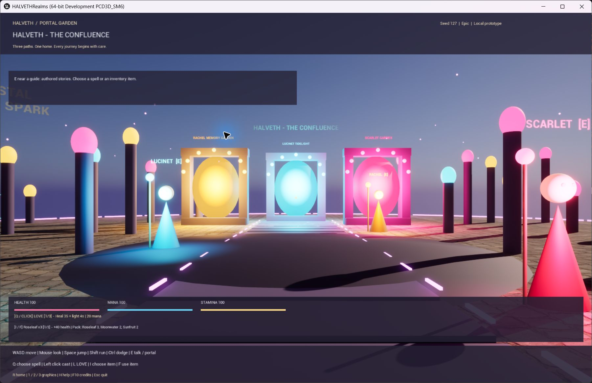
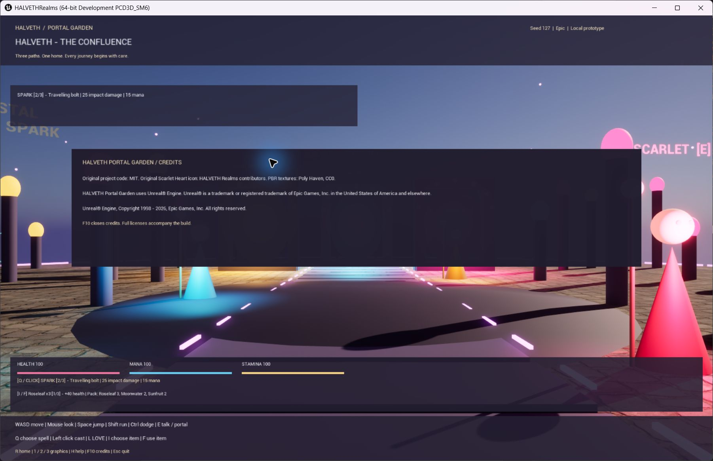

# Native validation — 23 September 2026

This is a small original, playable prototype. It is not a port of Morrowind, a finished open-world RPG, or a claim of universal platform compatibility.

## Actual engine build and gameplay

The Editor C++ target compiled successfully on the installed **Unreal Engine 5.8.0, changelist 55116800**, with **MSVC 14.51.36257** and Windows SDK 10.0.26100.0. The compiler is newer than Epic's preferred toolchain; the observed result is this build, not general toolchain compatibility. Compilation was limited to two parallel actions.

`HALVETHPrepare` completed with exit 0 and created one original surface material, two PBR materials and six texture assets from the supplied Poly Haven 2K PNGs. Generated editor assets contain installation-specific import metadata and are rebuilt locally, not published as source assets.

The expanded 24-step runtime test completed with exit 0. It checked actual game objects and state transitions:

- Hub collision and three portal destinations, each with a return journey.
- LOVE, fall recovery, invalid destination rejection and actual quality-setting values.
- Health loss and item recovery, retaining the item when health is full.
- AEGIS reducing a 40-point damage input to 10 points, followed by LOVE recovery.
- A nearby guide's authored dialogue, stamina cost and actual dodge displacement.
- Four travelling SPARK projectiles hitting the training crystal: 100, 75, 50, 25, 0 HP; visible-state break and subsequent regeneration to 100 HP.

The runtime test uses NullRHI and therefore does not prove rendering. Its final detail is `portals_love_collision_recovery_quality_inventory_shield_npc_dodge_four_projectile_hits_crystal_regeneration`.

## Separate visual observation

A separate native game window was launched with **DX12 / SM6** and the Epic quality preset on an NVIDIA GeForce RTX 4070 SUPER. The hub, PBR floor, three glowing portals, guide figures, lighting, status bars and controls rendered. The Q key visibly changed the selected spell to SPARK; F10 opened the credits.

These are direct native screenshots, not generated mockups or a substitute for testing a packaged executable. This pass does not establish minimum hardware, sustained frame rates, other GPUs, gamepad support, or every resolution. The guide figures and world geometry are deliberately early procedural forms; cinematic characters, skeletal animation and a large story campaign remain development work.

## Packaged executable

Unreal Automation Tool completed BuildCookRun with **BUILD SUCCESSFUL**, exit **0**, in 105.82 seconds. The Win64 Development package contains cooked materials and world code, the original heart icon, own-source licenses, Poly Haven artwork notices and the prepared engine third-party license collection.

The packaged `HALVETHRealms/Binaries/Win64/HALVETHRealms.exe` then completed the same 24-step test. Its fresh receipt was recorded at **2026-09-23T01:45:03Z** with `passed: true` and `renderingVerified: false`; the game log records an orderly exit. This is separate from the earlier Editor-hosted test.

The package's top-level `HALVETHRealms.exe` also launched a standalone **PCD3D_SM6** window, using the D3D12 renderer. The actual hub, PBR floor, lights, guides, native HUD and original window icon were visually inspected. The requested render size was 1440 x 900; the screenshot includes Windows DPI scaling and window chrome. Automated foreground activation was unavailable for this packaged pass, so it does not add a new physical-keyboard test to the earlier Editor-hosted Q/F10 observation. The QA-owned process was closed normally after inspection.

Runtime-generated `HALVETHRealms/Saved` files are excluded from distribution. Engine stage metadata is retained. Development runtime dependencies are preserved intact; no ad hoc DLL stripping is used. An installed-package receipt records installer tests separately.

## Bounded frame sample

A separate packaged run requested 900 CSV-profiler frames in the stationary hub, Epic preset, DX12/SM6, requested 1440 x 900, with the 60 FPS cap. After excluding the first 120 startup frames, the remaining **780 frames / 13.00 seconds** averaged **16.667 ms** (approximately **60.00 FPS**); the 95th-percentile frame time was **17.024 ms**. Installer compression and other local applications were running concurrently. This is one short capped scene sample, not an uncapped benchmark, sustained traversal result or minimum-hardware claim.

The CSV completed and the engine log requested orderly exit with status 0. The process observer returned 777003, an unresolved discrepancy retained in [FRAME-SAMPLE.json](FRAME-SAMPLE.json); this profiling run is not represented as an exit-0 process test. Raw profiler metadata remains local.

## Installer and installed game

The unsigned NSIS 3.12 installer completed with exit 0 in a previously absent per-user installation directory. All **1,348 installed payload files** matched the prepared manifest hashes. The installed native game then completed its fresh 24-step NullRHI gameplay test with **exit 0**.

The uninstaller completed with exit 0, removed the game executable, registration and desktop shortcut, and preserved **five runtime/fixture files with identical hashes**. Reinstallation completed with exit 0; all 1,348 payload hashes matched again and the retained files remained unchanged. The two test-created marker files were then removed individually. The game is left installed and ready to start.

See [RELEASE-VALIDATION.json](RELEASE-VALIDATION.json) for bounded observations and the exact installer/portable hashes. The original installer build receipt remains a historical build-only record; the later installation test does not rewrite that earlier receipt.

## Release boundary

Original source code remains MIT. The Unreal runtime retains Epic's terms. The supplied Poly Haven textures are CC0; the original Scarlet Heart icon retains its MIT attribution. No Morrowind game data or engine source is included in the public repository. The installer is unsigned. This work does not establish performance on other hardware, persistence, a finished campaign, realistic characters, online AI dialogue or a Steam release.
