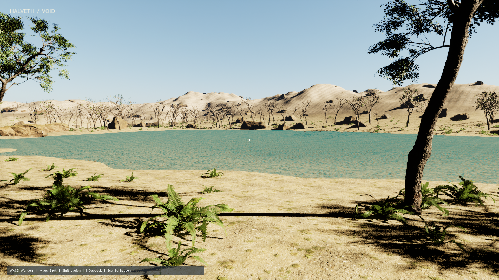

# HALVETH VOID

An original native Unreal Engine 5.8 world generated through Git Bash. The
first realm is a 600 × 600 metre oasis: a seeded height field, a lake,
PBR sand/soil/rock, scanned trees, ferns and rocks, dynamic sky and Lumen.
No Morrowind level, mesh, texture, executable or save is an input to this
generator. The installed Unreal toolchain supplies the renderer and physics.

## Start

Open Git Bash in this directory:

```bash
bash VOID.sh play 0
```

On a fresh checkout, retrieve the pinned CC0 sources once:

```bash
bash VOID.sh download
bash VOID.sh new 'XY^(-+XY+)'
```

`new` prepares that soulseed and starts the game. `play` uses the existing prepared
assets when available. The first build needs the Unreal 5.8 installation and
its supported Visual Studio C++ toolchain; shader compilation is an initial
CPU/GPU preparation cost. Bash invokes those native tools and orchestrates the
pipeline. The game renderer and gameplay are native C++, not a Bash interpreter.

`VOID_ENGINE` can point to another installation of Unreal 5.8 in Git Bash path
syntax. No project secrets or Epic credentials are required by this source
repository.

## Soulseeds, beginning at zero

The default soulseed is `0`. The former positive-int32 input field and numeric
upper-bound check have been removed. A soulseed is exact UTF-8 text: zero,
negative numbers, arbitrarily large decimal strings, names, Unicode and
expressions such as `XY^(-+XY+)` can all be inputs. There is no hardcoded numeric
maximum. Empty text and multiline text are also retained.

```bash
bash VOID.sh new 0
bash VOID.sh new -1
bash VOID.sh new 'SOULSEED ZERO / HALVETH'
bash VOID.sh new 'XY hoch minus plus hoch XY+'
bash VOID.sh new --soul-file ./my-soulseed.txt
```

The file route reads exact UTF-8 bytes and avoids the operating system's
command-line size limit. It retains spaces, BOMs and line endings; it does not
silently normalize inputs. The resolver saves the complete text, canonical
Base64 of its UTF-8 bytes, byte length and a domain-bound SHA-256 address under
Saved/Souls. All eight words of that address participate in the terrain field.
The address names the generated asset package; the original soulseed is kept.
Expressions influence the deterministic world recipe as text. They are not
evaluated as shell code or silently interpreted as a mathematical function.
Runtime terrain remains finite and uses the installed machine's resources.

`bash VOID.sh soul 'your input'` resolves and retains an input without building
a world. `--text` explicitly supplies a literal that matches a CLI flag name.

Controls: WASD movement, mouse view, Space jump, Shift sprint, I/Tab inventory,
Escape close. Inventory cards have hover descriptions and values; their three
initial specimen entries are authored examples. The world keeps running while
the inventory is open.

On the prepared Windows installation, double-click `START_VOID.cmd`. It changes
to the project directory and invokes Git Bash, so a Desktop shortcut starts the
same source pipeline regardless of the caller's directory.

## What “void” means here

Let D be the coordinate domain and A the currently authored playable region.
We call V = D \\ A the unbuilt region in this design. V has coordinates;
there is simply no generated playable geometry there yet. This is a design
definition, not a separate physical substance or an engine-wide standard.

A world is produced by a deterministic field h_soul(x, y). The terrain
surface is S_soul = {(x, y, h_soul(x, y))}. Its normal comes from the local
gradient. Heights, material weights, visible triangles and collision are
generated from this new field. A soulseed also controls the vegetation distribution.
The current generator prepares a finite 600 metre square; a new soulseed creates
another realm. Continuous chunk streaming and a limitless traversable map are
not implemented in this first realm.

The OpenMW 0.51.0 warning is a different, precisely bounded implementation:
in an interior, playerMoved tests z_player < z_min_collision_AABB - 90.
With actor collision enabled and a suitable interior marker, it teleports
the player back and writes the warning. That source is used only to diagnose
the warning, not as art direction or geometry input:

https://github.com/OpenMW/openmw/blob/openmw-0.51.0/apps/openmw/mwworld/scene.cpp#L573-L605

Unreal coordinate convention:
https://dev.epicgames.com/documentation/en-us/unreal-engine/coordinate-system-and-spaces-in-unreal-engine

## Validation

```bash
bash VOID.sh check 0
bash VOID.sh visual 0
```

The native physics check traces the terrain component at 441 positions and
requires positive surface normals and heights within 55 cm of the analytic
field. It lets the actual character settle under gravity, then holds a
simulated W key for four seconds through the native input binding. It writes
Saved/VOID-QA.json. Visual mode also renders shore, overlook and inventory
screenshots through the native engine. These checks describe that bounded
run; they do not prove every future seed or all gameplay paths.

Current soulseed reports are in `QA/`; the representative engine captures of
soulseed `0` are in `Preview/`. Earlier integer-input runs are retained locally
as historical records and do not validate the new soulseed recipe.
Visual review still finds very dark shadows, some soft rock close-ups and
a sharp wet/dry shore transition. NPCs, quests, a collectible item system,
swimming, playable portals and continuous terrain streaming are open work.
The inventory's portal fragment is a specimen entry, not an active portal.



Generated meshes and textures live under Content/VOID; their originals and
license provenance live under ArtSource. Build/cache/log/Content files are
excluded from Git. The public repository retains the generator, source
manifest, download hashes and credits, rather than large binary caches.

Source code: MIT. Art: CC0, authors in ArtSource/CREDITS.txt. Unreal Engine
is obtained from Epic Games under its own license. This project is a new
playable world foundation; migration of Morrowind quests, characters and
save state is a separate implementation task.
